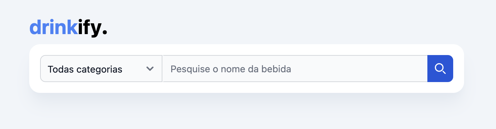

# drinkify.

Este repositório contém um projeto que está dividido em duas partes, frontend e backend.

## Backend

### Requisitos

- Node.js (versão 20.3.0 ou superior)
- yarn (gerenciador de pacotes do Node.js)

### Instalação

1. Navegue até a pasta `backend`:

    ```bash
    cd backend
    ```

2. Instale as dependências:

    ```bash
    yarn install
    ```

### Configuração

1. O arquivo .env necessário para executar o projeto já está inserido dentro do diretório, com as credenciais de teste necessárias para executar. Caso necessário, alterar para os valores desejados.

### Execução

1. Execute o build da aplicação:

    ```bash
    yarn build
    ```
2. Em seguida execute o comando para iniciar o servidor em modo de produção:

    ```bash
    yarn start:prod
    ```
O servidor estará em execução em `http://localhost:4000`.

## Frontend

### Requisitos

- Node.js (versão 20.3.0 ou superior)
- yarn (gerenciador de pacotes do Node.js)

### Instalação

1. Navegue até a pasta `frontend`:

    ```bash
    cd frontend
    ```

2. Instale as dependências:

    ```bash
    yarn install
    ```

### Execução

1. Execute o build da aplicação:

    ```bash
    yarn build
    ```
2. Em seguida execute o comando para iniciar o servidor em modo de produção:

    ```bash
    yarn preview
    ```
O servidor estará em execução em `http://localhost:3000`.

## Acessar
Para acessar, basta abrir o seu navegador de preferência e inserir na URL o endereço: http://localhost:3000